# elf-info: ergonomic CLI ELF inspection tool #

`elf-info` can inspect and display information about ELF binaries, the executable
format mostly used on Linux. This CLI tools aims at being ergonomic, without the
need of using two different commands (`objdump` and `readelf`) that have impossible
to remember options.

`elf-info` commands and options are easy to remember yet short and easy to type.
Efforts are made on the presentation of the data, using colors and ASCII tables.

For better ergonomics, you can set a `ELF` environment variable so not to have
to repeat the file name on each command.

## Quick and ergonomic disassembly ##

The `fn` subcommand is my favorite: give it a function’s name and its full
pretty-formatted disassembly is displayed.

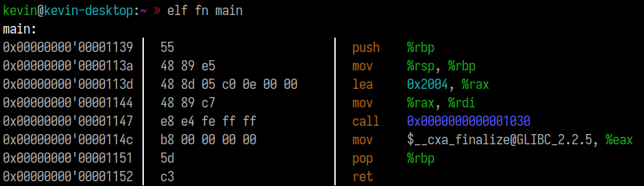

By passing `--cfi` you can superimpose call frame information (CFI):

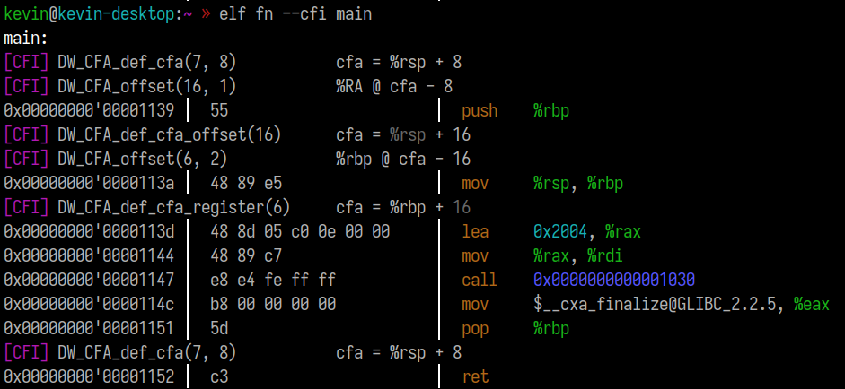

## Symbol tables ##

You can quickly list all symbols, and demangle the names.

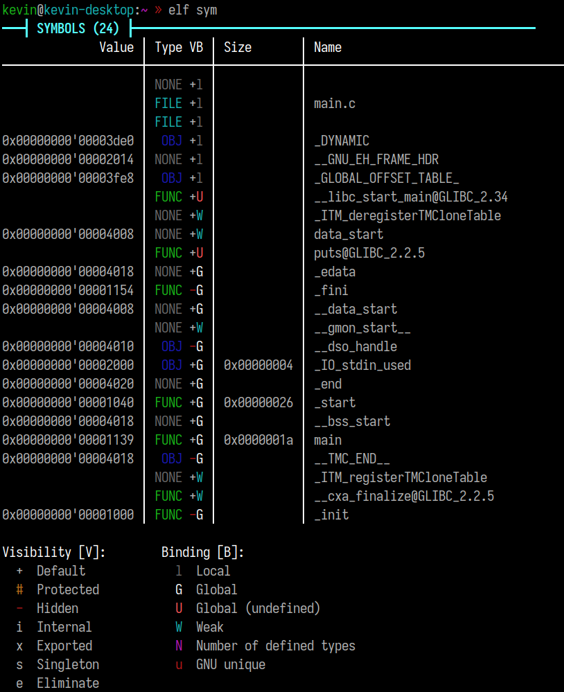

Pass `--no-demangle` for not demangling.\
Pass `-l` / `-g` / `-w` / `-d` to only display local / global / weak / defined symbols.\
Pass `-t <TYPE>` to filter by symbol type.\
Pass `-D` to only display dynamic symbols.\
Pass `-f` to filter by symbol name using a regular expression.

## Sections ##

### List all sections ###

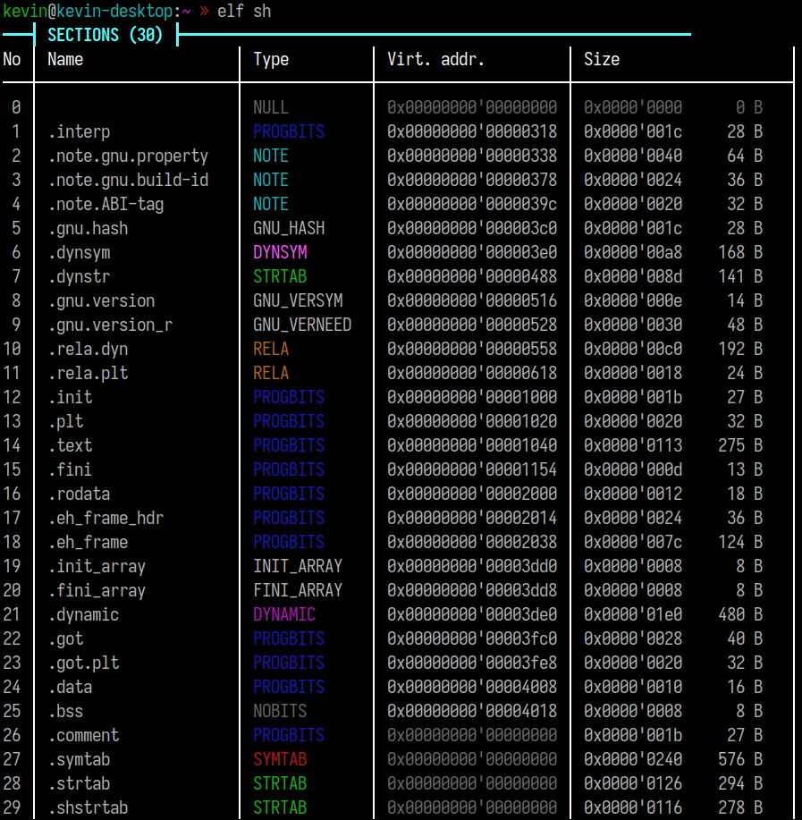

### Show specific section content ###

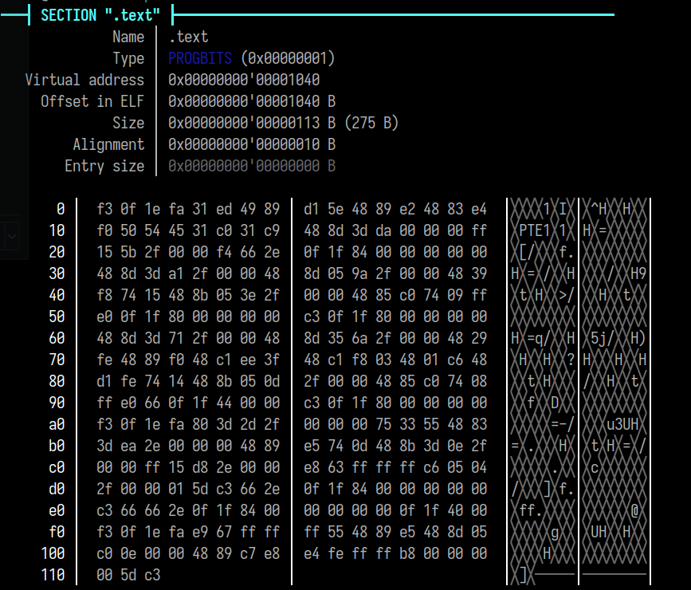

### String table sections ###

For some type of sections, `elf-info` is able to interpret its content and
display it in a more usable way. For example, for a table of strings, all strings
are listed. You can add the option `-x` or `--hexdump` to always display a hexdump.

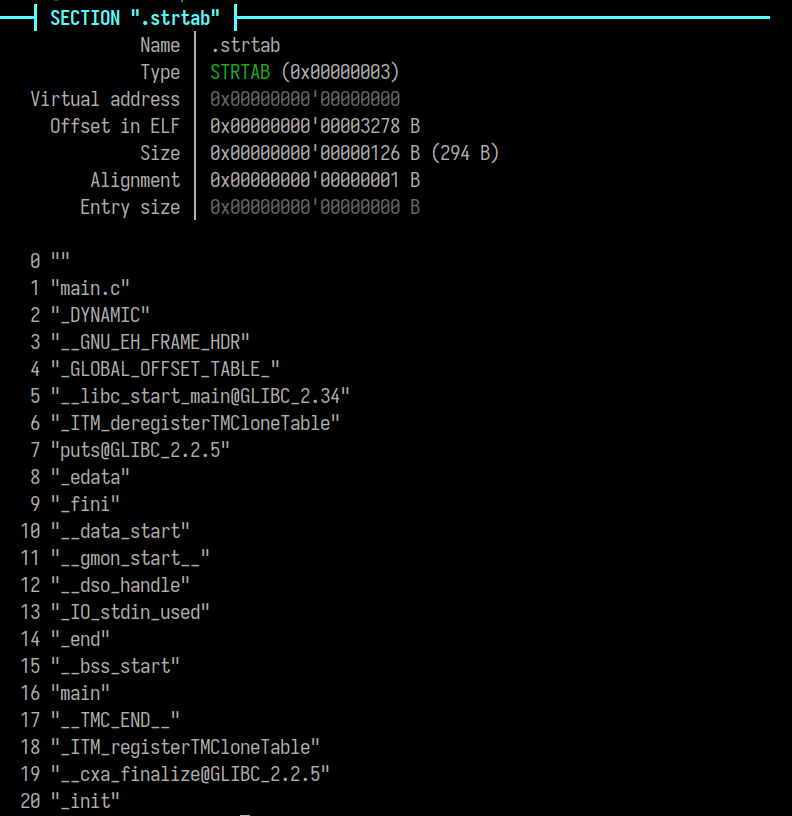

### .eh_frame_hdr section ###

In the same way, `elf-info` can pretty print the content of `.eh_frame_hdr`.

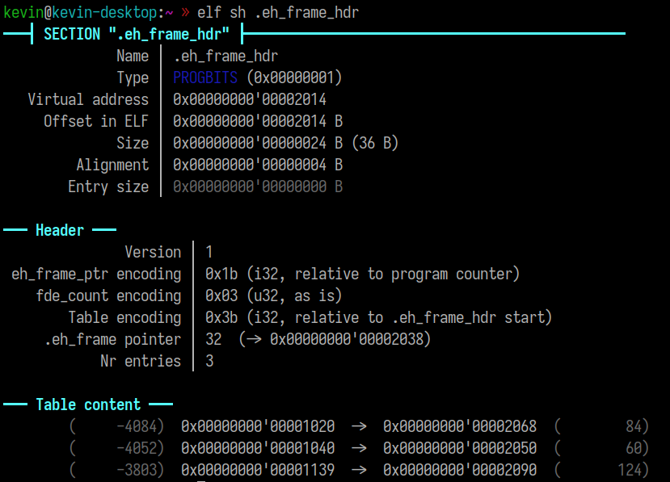

## ELF header ##

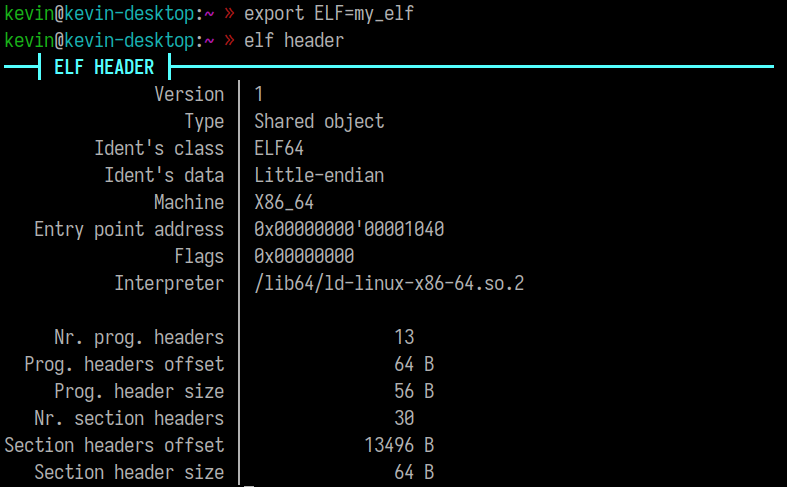

## Program headers ##

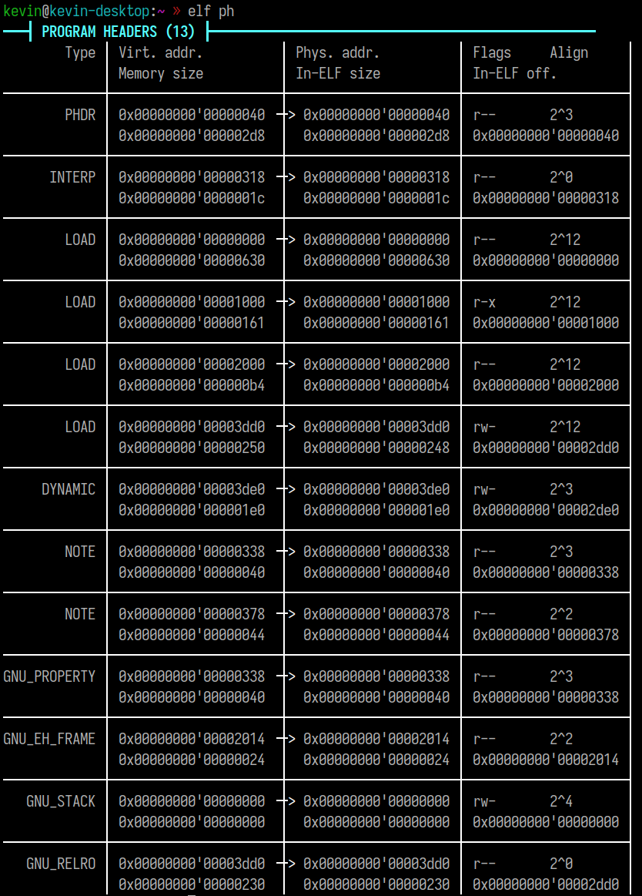

## Clear and structured exception-handling information ##

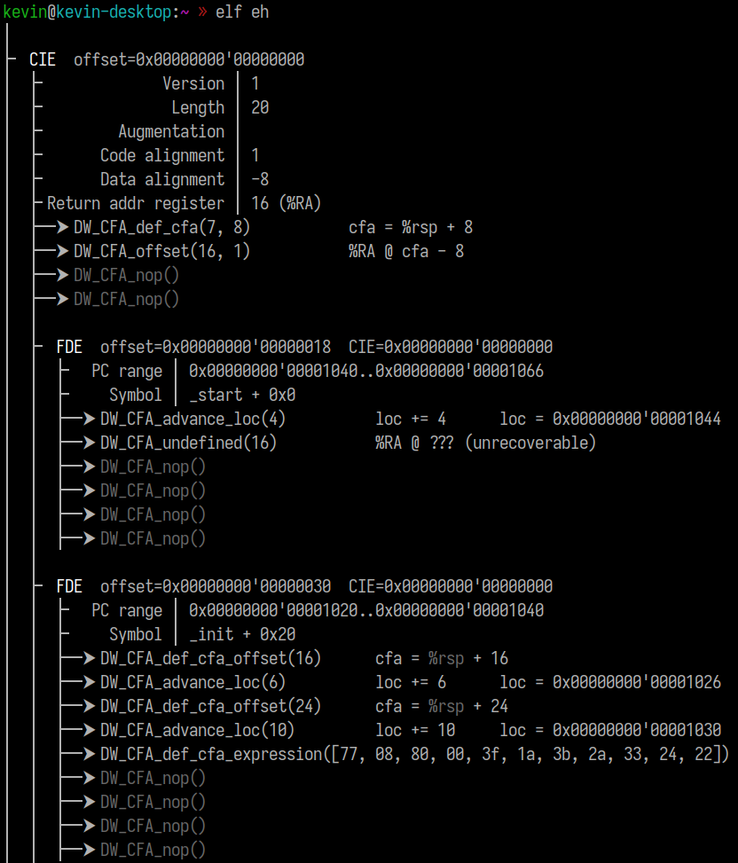

Quickly find EH information for a specific symbol with `-s`:

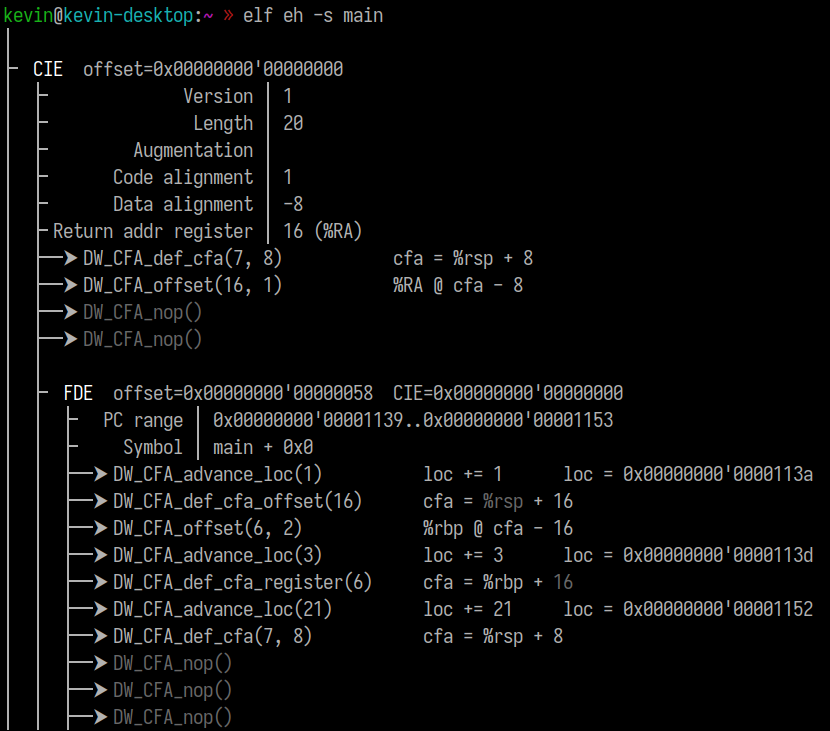
